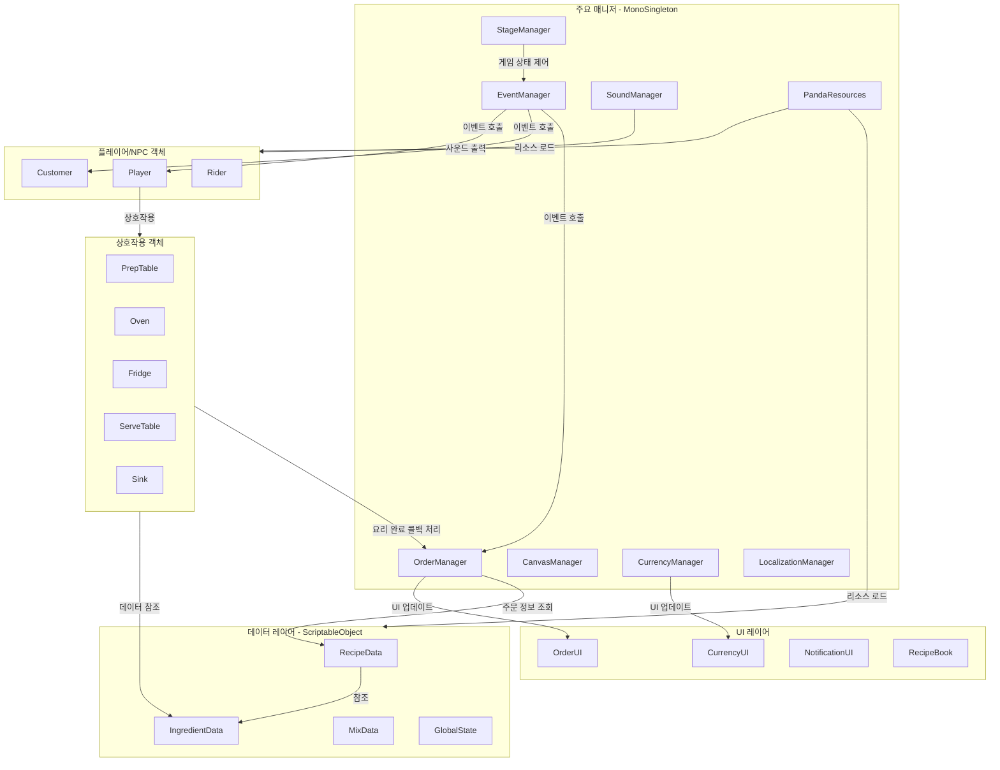

# PandaSushi

  
  
  
  
  

 
Unity로 개발한 <b>쿠킹 시뮬레이터 게임 프로젝트</b>입니다. 

 
판다 할아버지를 대신하여 가게를 잠깐(?) 맡게된 플레이어는 
여러 레시피들을 요리하고 재료들을 조합하며, 까다롭고 재밌는 돌발 상황들도 마주하면서 
식당을 운영하여 종합 리뷰 별점 5개를 채우는 것이 게임의 목표입니다. 

 

### 개발 정보
+ 개발 기간 : 2026.03 ~ 2026.05
+ 개발 인원 : 2인
+ 지원 언어 : English, 한국어
+ 타겟 플랫폼 : Windows, macOS, Linux/SteamOS

 

기획 의도 - 무료 에셋을 최대한으로 활용하여 코믹 요소를 섞은 게임 만들어보기!

 

> 해당 게임은 비상업용 프로젝트로 수익 창출이 아닌 포트폴리오 활용을 목적으로 배포하고 있습니다!

 

## 프로젝트 팀원 (Team.Campfire)
| 윤창범 | 이상화 | 
|:---:|:---:|
|  |  | 
| **프로그래밍**   3D 모델링   UI 디자인 | **2D 아트**   UI 디자인 | 

 

## 개발 환경
+ Unity (6000.3.7f1 LTS)
+ Blender (5.1.2) / JetBrains Rider (2025.2.2.1)
+ C#
+ Windows / macOS

 

## 주요 기술
| 기술 |  |
|:---:|:---|
| 싱글톤 패턴 | [MonoSingleton&lt;T&gt;](https://github.com/dbsckdqja75/PandaSushi/blob/main/Assets/02.%20Scripts/Pattern/MonoSingleton.cs) 구현으로 주요 매니저 클래스 관리   [StageManager](https://github.com/dbsckdqja75/PandaSushi/blob/main/Assets/02.%20Scripts/Core/StageManager.cs), [SoundManager](https://github.com/dbsckdqja75/PandaSushi/blob/main/Assets/02.%20Scripts/Core/SoundManager.cs), [CurrencyManager](https://github.com/dbsckdqja75/PandaSushi/blob/main/Assets/02.%20Scripts/Core/CurrencyManager.cs), [LocalizationManager](https://github.com/dbsckdqja75/PandaSushi/blob/main/Assets/02.%20Scripts/Core/LocalizationManager.cs) |
| 상태 패턴 | 분할 클래스 구현으로 [StageManager.State](https://github.com/dbsckdqja75/PandaSushi/blob/main/Assets/02.%20Scripts/Core/StageManager.State.cs)를 통해 게임의 흐름을 [EGameState](https://github.com/dbsckdqja75/PandaSushi/blob/main/Assets/02.%20Scripts/Enum/EGameState.cs)의 상태에 따라   개별 로직 관리 |
| 이벤트   기반 아키텍처 | [EventManager](https://github.com/dbsckdqja75/PandaSushi/blob/main/Assets/02.%20Scripts/Core/EventManager.cs)와 [PandaEvent](https://github.com/dbsckdqja75/PandaSushi/blob/main/Assets/02.%20Scripts/Core/PandaEvent.cs) 구현으로 클래스 간의 결합도를 낮추고   [EGameEvent](https://github.com/dbsckdqja75/PandaSushi/blob/main/Assets/02.%20Scripts/Enum/EGameEvent.cs)로 게임 상태 변화와 업데이트를 이벤트로 실시간 관리 |
| 오브젝트 풀링 | [ObjectPool](https://github.com/dbsckdqja75/PandaSushi/blob/main/Assets/02.%20Scripts/Core/ObjectPool.cs) 구현으로 손님, 라이더, FX 등 자주 생성되고 파괴되는 객체들은 재사용 관리 |
| 데이터 저장   &   암호화 | 중요 변수 또는 저장 데이터들을 [PlayerPrefsManager](https://github.com/dbsckdqja75/PandaSushi/blob/main/Assets/02.%20Scripts/Core/PlayerPrefsManager.cs), [EncryptAES](https://github.com/dbsckdqja75/PandaSushi/blob/main/Assets/02.%20Scripts/Extension/EncryptAES.cs) 구현으로 **AES암호화**하여 관리 |
| 레시피 데이터 관리 | **ScriptableObject** 기반으로 [RecipeData](https://github.com/dbsckdqja75/PandaSushi/blob/main/Assets/02.%20Scripts/Data/RecipeData.cs), [IngredientData](https://github.com/dbsckdqja75/PandaSushi/blob/main/Assets/02.%20Scripts/Data/IngredientData.cs), [MixData](https://github.com/dbsckdqja75/PandaSushi/blob/main/Assets/02.%20Scripts/Data/MixData.cs)를 구현하여   레시피/재료/조합 정보 관리 |
| 사운드 관리 | [SoundManager](https://github.com/dbsckdqja75/PandaSushi/blob/main/Assets/02.%20Scripts/Core/SoundManager.cs) 구현으로 인게임의 모든 BGM과 SFX 리소스 풀링 관리 및 Coroutine 기반으로   Volume, Mute, CrossFade 제어 |
| 리소스 관리 | [PandaResources](https://github.com/dbsckdqja75/PandaSushi/blob/main/Assets/02.%20Scripts/Core/PandaResources.cs) 구현으로 프리팹, 사운드, 아이콘 등의 자주 로드되는 리소스들을 참조하도록 관리 |
| 다국어 체계 | **Unity Localization** 패키지 기반으로 [LocalizationManager](https://github.com/dbsckdqja75/PandaSushi/blob/main/Assets/02.%20Scripts/Core/LocalizationManager.cs) 구현 및 여러 텍스트/이미지   언어별 동적 관리 |

 

## 구현 기능 (세부 내용)

- [플레이어](https://github.com/dbsckdqja75/PandaSushi/wiki/%ED%94%8C%EB%A0%88%EC%9D%B4%EC%96%B4)
- [상호작용](https://github.com/dbsckdqja75/PandaSushi/wiki/%EC%83%81%ED%98%B8%EC%9E%91%EC%9A%A9)
- [요리](https://github.com/dbsckdqja75/PandaSushi/wiki/%EC%9A%94%EB%A6%AC)
- [손님](https://github.com/dbsckdqja75/PandaSushi/wiki/%EC%86%90%EB%8B%98)
- [카메라](https://github.com/dbsckdqja75/PandaSushi/wiki/%EC%B9%B4%EB%A9%94%EB%9D%BC)
- [게임 흐름 관리](https://github.com/dbsckdqja75/PandaSushi/wiki/%EA%B2%8C%EC%9E%84-%ED%9D%90%EB%A6%84-%EA%B4%80%EB%A6%AC)
- [재고 관리 & 인테리어](https://github.com/dbsckdqja75/PandaSushi/wiki/%EC%9E%AC%EA%B3%A0-%EA%B4%80%EB%A6%AC-&-%EC%9D%B8%ED%85%8C%EB%A6%AC%EC%96%B4)
- [UI 관리 & 제어](https://github.com/dbsckdqja75/PandaSushi/wiki/UI-%EA%B4%80%EB%A6%AC-&-%EC%A0%9C%EC%96%B4)
- [사운드 시스템](https://github.com/dbsckdqja75/PandaSushi/wiki/%EC%82%AC%EC%9A%B4%EB%93%9C-%EC%8B%9C%EC%8A%A4%ED%85%9C)
- [설정](https://github.com/dbsckdqja75/PandaSushi/wiki/%EC%84%A4%EC%A0%95)
- [조작 시스템](https://github.com/dbsckdqja75/PandaSushi/wiki/%EC%A1%B0%EC%9E%91-%EC%8B%9C%EC%8A%A4%ED%85%9C)
- [커스텀 쉐이더 구성](https://github.com/dbsckdqja75/PandaSushi/wiki/%EC%BB%A4%EC%8A%A4%ED%85%80-%EC%89%90%EC%9D%B4%EB%8D%94-%EA%B5%AC%EC%84%B1)

 

## 프로젝트 설계 구조 (다이어그램)

프로젝트는 기본적으로 **매니저 패턴**과 **이벤트 기반 아키텍처**를 토대로 설계했습니다. 
 
자주 발생되어 호출되는 메서드들은 [EventManager](https://github.com/dbsckdqja75/PandaSushi/blob/main/Assets/02.%20Scripts/Core/EventManager.cs)를 통해 관리 및 호출할 수 있도록 구현했고, 
핵심이 되는 주요 매니저 클래스들만 [MonoSingleton](https://github.com/dbsckdqja75/PandaSushi/blob/main/Assets/02.%20Scripts/Pattern/MonoSingleton.cs)을 통해 전역적으로 접근할 수 있도록 구현했습니다.

초기에 설계를 확정짓고 진행한 구조가 아닌, 실제로 구현을 하면서 컨텐츠 규모를 생각했을때 
현재 구조가 수정 및 확장하기 가장 용이한 상태의 설계라고 생각하여 그대로 채택 및 진행하였습니다.

 

## 기술적 이슈와 아쉬운 점
+ **주요 클래스 구조 개선 미흡** 
> 플레이 가능한 수준까지 개발을 진행하고, 배포할때까지 지속적으로 타협하는 구조로 리팩토링 및 개선을 진행했으나  
여전히 [StageManager](https://github.com/dbsckdqja75/PandaSushi/blob/main/Assets/02.%20Scripts/Core/StageManager.cs)나 [OrderManager](https://github.com/dbsckdqja75/PandaSushi/blob/main/Assets/02.%20Scripts/Core/OrderManager.cs)와 같은 일부 핵심 클래스에 역할과 책임이 과하게 물려 있는 상태

 

+ **리소스 관리 구조 미흡** 
> 리소스가 엄청나게 많은 프로젝트는 아니지만 일반적인 변수, 프리팹, 사운드 등 참조해야할 게임 리소스 데이터들을 
**Addressables**나 **LoadAsync**를 활용하여 처음부터 구조를 개선했으면 좋았겠다 라는 아쉬움이 있음 

 

+ **애니메이션 구성 디테일** 
> 개발 초기에 고려하지 않았던 게임패드 조작 대응 및 가이드 구현을 마지막에 급하게 진행하면서 UI 디자인과 
관련 모션들을 다듬지 못했는데, 실제 플레이에서 엉성하다고 느껴지는 부분이 보일때가 있어서 다소 아쉬움이 있음 

 

## 트레일러 & 플레이 영상
<code>아직 카메라 감독님을 구하지 못한 이슈가..</code>

 

## 기타 정보
+ 오브젝트와 캐릭터 모델링, 게임패드 관련 UI 리소스는 무료 에셋을 활용하였습니다.   Special Thanks - [Quaternius](https://quaternius.com/), [Kenney](https://kenney.nl/assets)
+ 파티클 이펙트와 사운드 효과음은 유료 에셋을 수정 및 활용하였으며, **배경음악은 생성형 AI**를 활용하여 사용했습니다.
+ **게임패드 조작 대응**을 지원하기 때문에 **키보드/게임패드 조작 전환**이나 **스팀덱 환경**에서도 플레이가 가능합니다.
+ 저장소에 반영된 **AES 암호화 키**는 테스트 더미 키값으로 실제 실행 환경에는 다른 키값이 적용되어있습니다.
+ 기능/이펙트 유료 에셋 패키지의 실제 리소스는 저장소에 포함되어있지 않습니다.
+ 기본 에셋을 제외한 **일부 재료, 캐릭터 부착 오브젝트, 라이더 오토바이 등** 은 직접 **Blender**로 모델링하여 활용했습니다.
+ 직접 작업한 리소스들에 대한 관련 정보는 별도로 정리한 [위키 문서](https://github.com/dbsckdqja75/PandaSushi/wiki/%EB%A6%AC%EC%86%8C%EC%8A%A4-%EC%9E%91%EC%97%85)에서 확인하실 수 있습니다.

 

## 게임 다운로드
### <a href="https://github.com/dbsckdqja75/PandaSushi/releases/latest/download/PandaSushi_Windows.zip">Github 배포 파일 (Windows)</a>
### <a href="https://team-campfire.itch.io/pandasushi">itch.io 배포 페이지</a>

