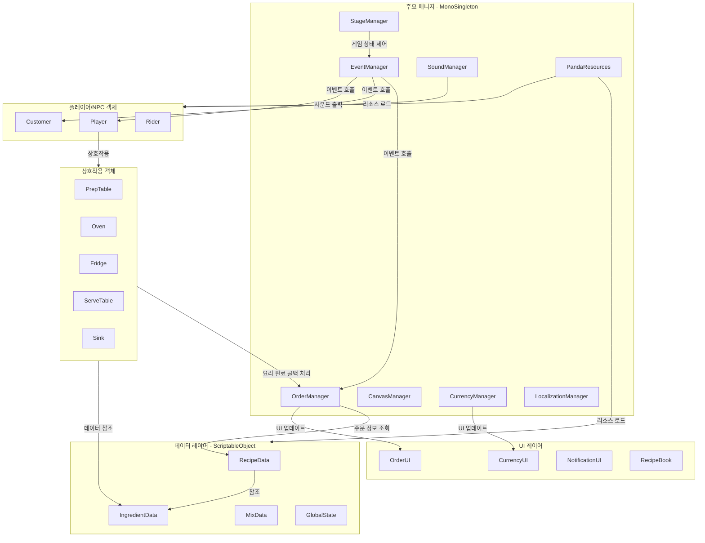

# PandaSushi

  
  
  
  

 
Unity로 개발한 <b>쿠킹 시뮬레이터 게임 프로젝트</b>입니다. 

 
판다 할아버지를 대신하여 가게를 잠깐(?) 맡게된 플레이어는 
여러 레시피들을 요리하고 재료들을 조합하며, 까다롭고 재밌는 돌발 상황들도 마주하면서 
식당을 운영하여 종합 리뷰 별점 5개를 채우는 것이 게임의 목표입니다. 

  

+ 개발 기간 : 2026.03 ~ 2026.05
+ 개발 인원 : 2인
+ 타겟 플랫폼 : Windows, macOS, Linux/SteamOS

 

***

## 팀원
| 윤창범 | 이상화 | 
|:---:|:---:|
|  |  | 
| 프로그래밍 / 3D 모델링 / UI 디자인 | 2D 아트 / UI 디자인 | 

 

## 개발 환경
+ Unity (6000.3.7f1 LTS)
+ JetBrains Rider (2025.2.2.1)
+ C#
+ Windwos / macOS

 

## 주요 기술
| 기술 |  |
|:---:|:---|
| 싱글톤 패턴 | [MonoSingleton&lt;T&gt;](https://github.com/dbsckdqja75/PandaSushi/blob/main/Assets/02.%20Scripts/Pattern/MonoSingleton.cs) 구현으로 주요 매니저 클래스 관리   [StageManager](https://github.com/dbsckdqja75/PandaSushi/blob/main/Assets/02.%20Scripts/Core/StageManager.cs), [SoundManager](https://github.com/dbsckdqja75/PandaSushi/blob/main/Assets/02.%20Scripts/Core/SoundManager.cs), [CurrencyManager](https://github.com/dbsckdqja75/PandaSushi/blob/main/Assets/02.%20Scripts/Core/CurrencyManager.cs), [LocalizationManager](https://github.com/dbsckdqja75/PandaSushi/blob/main/Assets/02.%20Scripts/Core/LocalizationManager.cs) |
| 상태 패턴 | 분할 클래스 구현으로 [StageManager.State](https://github.com/dbsckdqja75/PandaSushi/blob/main/Assets/02.%20Scripts/Core/StageManager.State.cs)를 통해 게임의 흐름을 [EGameState](https://github.com/dbsckdqja75/PandaSushi/blob/main/Assets/02.%20Scripts/Enum/EGameState.cs)에 따라 상태별 로직 관리 |
| 이벤트 기반 아키텍처 | [EventManager](https://github.com/dbsckdqja75/PandaSushi/blob/main/Assets/02.%20Scripts/Core/EventManager.cs)와 [PandaEvent](https://github.com/dbsckdqja75/PandaSushi/blob/main/Assets/02.%20Scripts/Core/PandaEvent.cs) 구현으로 클래스 간의 의존성을 낮추고   [EGameEvent](https://github.com/dbsckdqja75/PandaSushi/blob/main/Assets/02.%20Scripts/Enum/EGameEvent.cs)로 게임 상태 변화와 업데이트를 이벤트로 실시간 관리 |
| 오브젝트 풀링 | [ObjectPool](https://github.com/dbsckdqja75/PandaSushi/blob/main/Assets/02.%20Scripts/Core/ObjectPool.cs) 구현으로 손님, 라이더, FX 등 자주 생성되고 파괴되는 객체들은 재사용 관리 |
| 데이터 저장 & 암호화 | 중요 변수 또는 저장 데이터들을 [PlayerPrefsManager](https://github.com/dbsckdqja75/PandaSushi/blob/main/Assets/02.%20Scripts/Core/PlayerPrefsManager.cs), [EncryptAES](https://github.com/dbsckdqja75/PandaSushi/blob/main/Assets/02.%20Scripts/Extension/EncryptAES.cs) 구현으로 **AES암호화**하여 관리 |
| 레시피 데이터 관리 | **ScriptableObject** 기반으로 [RecipeData](https://github.com/dbsckdqja75/PandaSushi/blob/main/Assets/02.%20Scripts/Data/RecipeData.cs), [IngredientData](https://github.com/dbsckdqja75/PandaSushi/blob/main/Assets/02.%20Scripts/Data/IngredientData.cs), [MixData](https://github.com/dbsckdqja75/PandaSushi/blob/main/Assets/02.%20Scripts/Data/MixData.cs)를 구현하여 레시피/재료/조합 정보 관리 |
| 사운드 관리 | [SoundManager](https://github.com/dbsckdqja75/PandaSushi/blob/main/Assets/02.%20Scripts/Core/SoundManager.cs) 구현으로 인게임의 모든 BGM과 SFX 리소스 풀링 관리 및 Coroutine 기반으로   Volume, Mute, CrossFade 제어 |
| 리소스 관리 | [PandaResources](https://github.com/dbsckdqja75/PandaSushi/blob/main/Assets/02.%20Scripts/Core/PandaResources.cs) 구현으로 프리팹, 사운드, 아이콘 등의 자주 로드되는 리소스들을 참조하도록 관리 |
| 다국어 체계 | **Unity Localization** 패키지 기반으로 [LocalizationManager](https://github.com/dbsckdqja75/PandaSushi/blob/main/Assets/02.%20Scripts/Core/LocalizationManager.cs) 구현 및 여러 텍스트/이미지 언어별 동적 관리 |

 

## 구현 기능 (세부 내용)

!!! 작성 중 !!!

  
플레이어

  
손님

  
카메라

  
상호작용

  
요리

  
재고 관리/인테리어

  
UI 관리/제어

  
게임패드 조작/가이드 구현

 

## 프로젝트 설계 시각적 구조 (다이어그램)

프로젝트는 기본적으로 **매니저 패턴**과 **이벤트 기반 아키텍처**를 토대로 설계했습니다. 
 
자주 발생되어 호출되는 메서드들은 EventManager를 통해 관리 및 호출할 수 있도록 구현했고, 
핵심이 되는 주요 매니저 클래스들만 MonoSingleton을 통해 전역적으로 접근할 수 있도록 구현했습니다.

초기에 설계를 확정짓고 진행한 구조가 아닌, 실제로 구현을 하면서 플레이 환경 규모를 생각했을때 
현재의 구조가 가장 적합하고 수정이 용이한 설계라고 생각하여 그대로 채택하였습니다.

  

## 게임 다운로드
### <a href="https://github.com/dbsckdqja75/PandaSushi/releases/download/v1.3/PandaSushi_Windows.zip">Github 배포 파일 (Windows)</a>
### <a href="https://team-campfire.itch.io/pandasushi">itch.io 배포 페이지</a>

